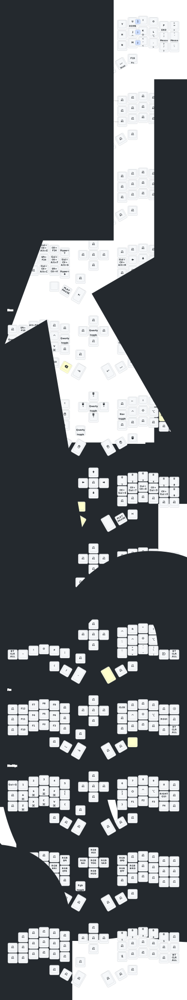

#    Eyelash Corne ZMK Repository

**This keyboard is not the same as [foostan's Corne](https://github.com/foostan/crkbd). It will not work with standard `corne` firmware.**

## Instructions

1. [Fork this repository](https://docs.github.com/en/get-started/quickstart/fork-a-repo#forking-a-repository).
2. [Click the **Actions** tab and make sure the workflow is enabled](https://docs.github.com/en/actions/managing-workflow-runs-and-deployments/managing-workflow-runs/disabling-and-enabling-a-workflow#enabling-a-workflow).
3. Use [Keymap Editor](https://nickcoutsos.github.io/keymap-editor/) to remap easier. 

**If you already have a ZMK config repository, [you can add this one as a module instead of forking](https://zmk.dev/docs/features/modules#building-with-modules).**

## Credit
- https://github.com/urob/zmk-config
- https://github.com/manna-harbour/miryoku_zmk

<!-- ## Keymap Diagram
No longer up to date
 -->

